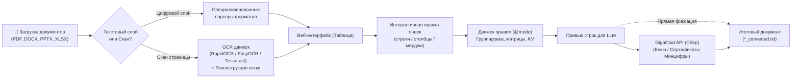

# 📄 DocuFlow AI • Document Parser for FAQ

[](https://python.org)
[](https://fastapi.tiangolo.com)
[](https://developers.sber.ru)
[](https://github.com/RapidAI/RapidOCR)
[](LICENSE)
[](#)

**DocuFlow AI** — современная интеллектуальная платформа для извлечения таблиц и текстовых блоков из документов любых форматов (**PDF**, **DOCX**, **PPTX**, **XLSX**, включая отсканированные страницы через нейросетевой **OCR**), их интерактивной корректировки в веб-интерфейсе, декларативного преобразования с помощью гибкого движка правил и последующей генерации структурированных баз знаний и FAQ с помощью **LLM GigaChat** от Сбера.

---

## 📑 Содержание

- [✨ Ключевые возможности](#-ключевые-возможности)
- [🏗 Архитектура и рабочий процесс](#-архитектура-и-рабочий-процесс)
- [📂 Поддерживаемые форматы и особенности парсинга](#-поддерживаемые-форматы-и-особенности-парсинга)
- [🔍 Оптическое распознавание символов (OCR)](#-оптическое-распознавание-символов-ocr)
- [⚙️ Декларативный движок правил преобразования](#️-декларативный-движок-правил-преобразования)
- [🤖 Интеграция с GigaChat](#-интеграция-с-gigachat)
- [📁 Структура проекта](#-структура-проекта)
- [🚀 Быстрый старт и установка](#-быстрый-старт-и-установка)
- [📦 Сборка в автономный исполняемый файл (Desktop EXE)](#-сборка-в-автономный-исполняемый-файл-desktop-exe)
- [🔌 REST API эндпоинты](#-rest-api-эндпоинты)
- [🧪 Тестирование](#-тестирование)
- [📜 Лицензия](#-лицензия)

---

## ✨ Ключевые возможности

* 🚀 **Мультиформатный парсинг:** Извлечение сложных таблиц и параграфов из **PDF**, **Word (.docx)**, **PowerPoint (.pptx)** и **Excel (.xlsx)**.
* 🧩 **Корректная обработка сложных ячеек:** Автоматическое определение и нормализация объединенных ячеек (по горизонтали `gridSpan` / `span_width` и по вертикали `vMerge` / `span_height`).
* 👁️ **Распознавание сканов (OCR):** Автоматическая детекция страниц без цифрового текстового слоя с распознаванием через **RapidOCR (ONNX)**, **EasyOCR (PyTorch)** или **Tesseract**, включая алгоритмическую реконструкцию координатной сетки таблиц.
* ✍️ **Интерактивный редактор таблиц прямо в браузере:**
  * Добавление, вставка, удаление и перемещение строк (вверх / вниз).
  * Добавление, вставка, удаление и перемещение колонок (влево / вправо).
  * Объединение ячеек вправо / вниз и разъединение.
  * Редактирование текста любой ячейки «на лету» с возможностью сброса к оригиналу.
* 🎯 **Декларативный синтаксис правил:** Преобразование сырых двумерных таблиц в читаемый текст с помощью директив (`@mode row`, `@mode group`, `@mode matrix`, `@mode kv`, `@mode column`, `@mode flat`, `@header_rows`, `@group_by` и др.) и шаблонов с переменными (`{0}`, `{Заголовок}`, `{_row}`, `{_group}`, `{_value}` и др.).
* 🧠 **Глубокая интеграция со Сбер GigaChat:**
  * Поддержка всех моделей: `GigaChat-2-Max`, `GigaChat-2-Pro`, `GigaChat-2`, `GigaChat-2-Lite`, `GigaChat-Max`, `GigaChat-Ultra`, `GigaChat-Pro` и др.
  * 2 способа аутентификации: по API-ключу (Basic Auth) и по защищенным сертификатам Минцифры (**mTLS / Russian Trusted Root CA**).
  * Настройка температуры генерации, скоупов (`PERS`, `B2B`, `CORP`) и системных промптов.
* 💾 **Сборка и экспорт готового документа:** Сохранение преобразованного текста каждой таблицы и скачивание единого итогового документа `*_converted.txt`, где сырые таблицы заменены на сформированный FAQ.
* 💻 **Ультрасовременный веб-интерфейс (Glassmorphism):** Переключение темной/светлой темы, drag-and-drop файлов и папок, встроенное модальное руководство с готовыми шаблонами правил.

---

## 🏗 Архитектура и рабочий процесс



1. **Загрузка:** Пользователь загружает файлы через Drag & Drop или проводник (поддерживается пакетная загрузка файлов и целых папок).
2. **Парсинг / OCR:** Документы разбираются на последовательность параграфов и таблиц с сохранением исходного порядка и метаданных объединений ячеек.
3. **Визуализация и правка:** Таблица отображается в интерактивной сетке; при необходимости можно поправить опечатки распознавания, удалить лишние колонки или объединить ячейки.
4. **Применение правил:** Пользователь выбирает подходящий режим обхода и шаблон — движок за миллисекунды преобразует строки таблицы в текстовые блоки.
5. **Генерация FAQ:** Преобразованный текст отправляется в GigaChat, который формирует готовые пары вопрос-ответ.
6. **Экспорт:** Готовый результат фиксируется для каждой таблицы, после чего формируется и скачивается финальный текстовый документ.

---

## 📂 Поддерживаемые форматы и особенности парсинга

| Формат | Парсер | Особенности и обработка структур |
| :--- | :--- | :--- |
| **PDF** | `app/parsers/pdf_parser.py` | Векторный анализ разметки через `pdfplumber`, фильтрация текста от границ таблиц. Автоматическое переключение на OCR-пайплайн при отсутствии текстового слоя. |
| **DOCX** | `app/parsers/docx_parser.py` | Прямой разбор OpenXML (`w:tc`, `w:tr`). Полная поддержка горизонтальных (`gridSpan`) и вертикальных (`vMerge`, `restart`/`continue`) объединений с пробросом значений в подчиненные ячейки. |
| **PPTX** | `app/parsers/pptx_parser.py` | Разбор слайдов, форм и презентационных таблиц с поддержкой ячеек-источников (`is_merge_origin`) и диапазонов слияния (`span_width`, `span_height`). |
| **XLSX** | `app/parsers/xlsx_parser.py` | Парсинг всех листов рабочей книги Excel через `openpyxl`. Автоматическое размножение значений объединенных ячеек (`merged_cells`) на всю область объединения. |

---

## 🔍 Оптическое распознавание символов (OCR)

Сервис включает встроенный модуль `app/ocr_service.py`, который поддерживает переключение между тремя OCR-движками:

1. **RapidOCR (ONNX Runtime) [Рекомендуется]:**
   - Быстрый запуск, легкие модели (~15 МБ), минимальное потребление RAM и высокая скорость инференса.
2. **EasyOCR (PyTorch):**
   - Глубокие сверточные нейросети для сложных и нестандартных шрифтов.
3. **Tesseract OCR:**
   - Классический движок оптического распознавания.

### Алгоритм реконструкции таблиц
При сканировании документа OCR возвращает список распознанных слов и координат Bounding Box. Алгоритм:
1. Вычисляет вертикальные центры (`y_center`) и горизонтальные координаты (`x_left`).
2. Кластеризует блоки в строки с настраиваемым допуском перепада по вертикали (`y_tolerance = 15px`).
3. Сортирует ячейки внутри строк слева направо.
4. Выравнивает количество колонок во всех строках, восстанавливая исходную двумерную матрицу.

---

## ⚙️ Декларативный движок правил преобразования

Сервис предоставляет выразительный синтаксис правил (полная документация доступна в [RULES_GUIDE.md](RULES_GUIDE.md)).

Правило состоит из **директив** (строки с `@`) и **шаблона** (строки с переменными `{...}`):

### Режимы работы (`@mode`)

* **`@mode row`** (по умолчанию) — построчный обход для плоских таблиц и списков:
  ```text
  @mode row
  @skip_empty
  @enumerate
  Вопрос: {Вопрос}
  Ответ: {Ответ} (Категория: {Категория})
  ```

* **`@mode group`** — группировка строк по объединенному столбцу (категории, разделы, модули):
  ```text
  @mode group
  @group_by 0
  @merge_repeated
  @header_rows 2
  Товар: {1} | Базовая цена: {2} | Премиум: {4}
  ```

* **`@mode matrix`** — перекрестная матрица (строка × столбец → значение) для прав доступа, тарифов, матриц ответственности:
  ```text
  @mode matrix
  @header_cols 1
  Для роли "{_row_header}" доступ к разделу "{_col_header}": {_value}
  ```

* **`@mode kv`** — ключ-значение для карточек оборудования, паспортов изделий и ТЗ:
  ```text
  @mode kv
  Параметр {_key}: {_value}
  ```

* **`@mode column`** — чтение таблицы вертикально по столбцам.
* **`@mode flat`** — сплошной плоский вывод всех ячеек через разделитель.

### Доступные переменные шаблона
* `{0}`, `{1}`, `{2}`... — значение ячейки по номеру колонки (0 — первый столбец).
* `{ИмяЗаголовка}` — значение ячейки по имени заголовка шапки (нечувствительно к регистру и пробелам).
* `{_row}` — номер текущей строки (начиная с 1).
* `{_group}` — название текущей группы (в режиме `@mode group`).
* `{_row_header}`, `{_col_header}`, `{_value}` — контекстные переменные для `@mode matrix`.
* `{_key}`, `{_value}` — переменные для `@mode kv`.
* `{_all}` — все непустые ячейки строки через разделитель `@separator`.

---

## 🤖 Интеграция с GigaChat

Клиент `app/gigachat_client.py` построен на базе официального SDK `gigachat` от Сбера и оптимизирован для корпоративного и персонального использования:

### Варианты аутентификации:
1. **По API-ключу (Basic Auth / Authorization Key):**
   - Укажите Client Secret из личного кабинета [developers.sber.ru](https://developers.sber.ru/studio/workspaces).
2. **По сертификатам Минцифры (mTLS / TLS):**
   - Корневой сертификат `Russian Trusted Root CA` (для проверки подлинности шлюза).
   - Клиентский сертификат (`.crt` / `.pem`) и закрытый ключ (`.key` / `.pem`).
   - Автоматическая валидация цепочки доверия и поддержка работы в защищенных корпоративных контурах.

### Поддерживаемые модели:
* `GigaChat-2-Max`, `GigaChat-2-Pro`, `GigaChat-2`, `GigaChat-2-Lite`
* `GigaChat-Max`, `GigaChat-Ultra`, `GigaChat-Pro`, `GigaChat-Plus`, `GigaChat`
* Скоупы: `GIGACHAT_API_PERS` (физлица), `GIGACHAT_API_B2B` (ИП), `GIGACHAT_API_CORP` (юрлица).

Настройки сохраняются в локальный файл конфигурации `settings.json` и автоматически подгружаются при перезапуске сервиса.

---

## 📁 Структура проекта

```
Preapare_en_vui/
├── app/
│   ├── parsers/                   # Парсеры форматов файлов
│   │   ├── base.py                # Абстрактный базовый класс BaseParser
│   │   ├── docx_parser.py         # Парсер DOCX с объединением ячеек
│   │   ├── pdf_parser.py          # Парсер PDF (pdfplumber + авто-OCR)
│   │   ├── pptx_parser.py         # Парсер PPTX с определением span
│   │   └── xlsx_parser.py         # Парсер XLSX с размножением объединенных диапазонов
│   ├── static/                    # Статические ассеты фронтенда
│   │   ├── index.html             # Главный интерфейс (SPA)
│   │   ├── script.js              # Интерактивная логика, горячие клавиши, API-вызовы
│   │   └── style.css              # Glassmorphism дизайн и темы оформления
│   ├── gigachat_client.py         # Клиент GigaChat SDK (ключи и mTLS-сертификаты)
│   ├── main.py                    # Приложение FastAPI, маршруты, движок правил
│   ├── models.py                  # Pydantic модели запросов и ответов
│   ├── ocr_service.py             # Сервис OCR (RapidOCR, EasyOCR, Tesseract)
│   ├── settings.json              # Сохраненная конфигурация пользователя
│   └── storage.py                 # In-memory хранилище состояния и настроек
├── dist/                          # Собранный автономный дистрибутив
│   └── DocuFlow/
│       ├── DocuFlow.exe           # Исполняемый файл приложения
│       ├── Start_DocuFlow.bat     # Скрипт быстрого запуска в один клик
│       └── settings.json          # Локальные настройки дистрибутива
├── test_files/                    # Набор документов для тестов и демонстрации
├── create_test_files.py           # Генератор тестовых документов
├── create_complex_test_files.py   # Генератор сложных таблиц с многоуровневыми слияниями
├── create_english_test_files.py   # Генератор демонстрационных файлов на английском
├── test_english_suite.py          # Автоматизированный интеграционный тест-сьют
├── DocuFlow.spec                  # Спецификация сборки PyInstaller
├── requirements.txt               # Зависимости проекта
├── run.py                         # Точка входа для запуска dev-сервера
└── RULES_GUIDE.md                 # Полное руководство по синтаксису правил
```

---

## 🚀 Быстрый старт и установка

### Системные требования:
* **ОС:** Windows 10/11, Linux или macOS.
* **Python:** 3.10, 3.11 или 3.12.

### 1. Клонирование и подготовка окружения
```powershell
# Создайте виртуальное окружение
python -m venv .venv

# Активируйте окружение (Windows PowerShell)
.\.venv\Scripts\Activate.ps1
# (или в cmd: .venv\Scripts\activate.bat)
```

### 2. Установка зависимостей
```bash
pip install --upgrade pip
pip install -r requirements.txt
```

> **Примечание:** Если вы планируете использовать Tesseract OCR, убедитесь, что бинарный пакет [Tesseract-OCR](https://github.com/UB-Mannheim/tesseract/wiki) установлен в системе и добавлен в системный `PATH`. Для RapidOCR дополнительных системных бинарников не требуется — движок работает «из коробки» на базе `onnxruntime`.

### 3. Запуск веб-сервера
```bash
python run.py
```
После запуска откройте браузер по адресу:
👉 **`http://localhost:8000`** (или **`http://127.0.0.1:8000`**)

---

## 📦 Сборка в автономный исполняемый файл (Desktop EXE)

Проект сконфигурирован для сборки в портативное Windows-приложение с помощью **PyInstaller**:

```bash
pyinstaller DocuFlow.spec
```

Результат сборки помещается в директорию `dist/DocuFlow/`:
* `DocuFlow.exe` — скомпилированный бинарный файл.
* `Start_DocuFlow.bat` — батник для моментального запуска (с автоматическим уведомлением об адресе в браузере).

Пользователю не требуется устанавливать Python — приложение полностью автономно.

---

## 🔌 REST API эндпоинты

| Метод | Путь | Описание |
| :--- | :--- | :--- |
| `POST` | `/api/upload` | Загрузка и парсинг файлов (`multipart/form-data`) |
| `GET` | `/api/files` | Получение списка загруженных файлов и их метаданных |
| `GET` | `/api/files/{file_id}` | Полное дерево содержимого файла (текст + таблицы) |
| `GET` | `/api/files/{file_id}/tables/{table_index}` | Получение конкретной таблицы по индексу |
| `PUT` | `/api/files/{file_id}/tables/{table_index}` | Сохранение отредактированной сетки таблицы и объединений |
| `POST` | `/api/files/{file_id}/tables/{table_index}/reset` | Сброс таблицы к исходному состоянию из документа |
| `POST` | `/api/transform` | Преобразование таблицы по заданным правилам (`rules`) |
| `POST` | `/api/files/{file_id}/tables/{table_index}/converted` | Фиксация готового текста для таблицы |
| `GET` | `/api/files/{file_id}/download-converted` | Скачивание итогового документа с заменой таблиц |
| `POST` | `/api/generate` | Отправка текста в GigaChat и получение FAQ |
| `GET` | `/api/settings` | Получение настроек API GigaChat и OCR |
| `POST` | `/api/settings` | Обновление и сохранение настроек |
| `DELETE`| `/api/files/{file_id}` | Удаление файла из сессии |
| `DELETE`| `/api/files` | Очистка всех файлов |

---

## 🧪 Тестирование

В репозиторий включен полный комплекс интеграционных тестов, проверяющих:
* Извлечение и заполнение многоуровневых объединенных ячеек во всех форматах.
* Все режимы обхода правил (`row`, `group`, `matrix`, `kv`).
* Автоматическое распознавание сканированных документов через OCR.

Для запуска тестов выполните:
```bash
python test_english_suite.py
```

Для генерации тестовых файлов:
```bash
python create_english_test_files.py
python create_complex_test_files.py
```

---

## 📜 Лицензия и стандарты сообщества

Проект распространяется под открытой лицензией [MIT License](LICENSE).

* 🛡️ **Политика безопасности:** [SECURITY.md](SECURITY.md)
* 🤝 **Правила участия в разработке:** [CONTRIBUTING.md](CONTRIBUTING.md)
* 📜 **Кодекс поведения участников:** [CODE_OF_CONDUCT.md](CODE_OF_CONDUCT.md)
